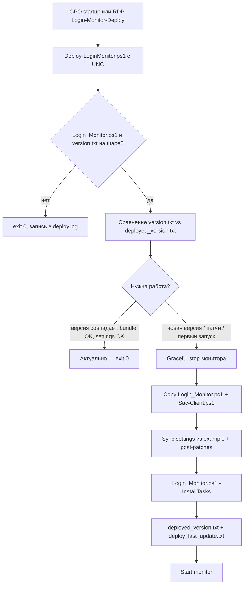

# Развёртывание RDP Login Monitor в домене

Монитор ставится в **`C:\ProgramData\RDP-login-monitor\`**, задачи планировщика создаёт **`Login_Monitor.ps1 -InstallTasks`**. Доставку по сети выполняет **`Deploy-LoginMonitor.ps1`**.

- Публикация на NETLOGON: [deploy-netlogon-publish.md](deploy-netlogon-publish.md)
- Exchange Mail Security (отдельный пакет): [exchange-mail-security.md](exchange-mail-security.md)

## Файлы на файловой шаре

Каталог, доступный **конечным компьютерам** на чтение (учётная запись компьютера домена / SYSTEM), например:

`\\dc.contoso.local\NETLOGON\RDP-login-monitor\`

| Файл | Назначение |
|------|------------|
| `Login_Monitor.ps1` | Основной скрипт мониторинга |
| `Sac-Client.ps1` | Клиент SAC (обязателен для SAC; сверка SHA256 при деплое) |
| `login_monitor.settings.example.ps1` | Образец настроек (bootstrap локального settings) |
| `version.txt` | **Одна строка** — версия пакета на шаре (например `1.2.27-SAC`) |
| `Deploy-LoginMonitor.ps1` | Установщик для GPO / scheduled task |

Полный список файлов на шару (включая Exchange): [deploy-netlogon-publish.md](deploy-netlogon-publish.md).

**Не копируются Deploy-LoginMonitor:** `ignore.lst`, `login_monitor.settings.ps1` (секреты локальны).

## Алгоритм Deploy (GPO startup / scheduled task)



Корень дистрибутива: **`-SourceShareRoot`** или родитель каталога `Deploy-LoginMonitor.ps1` при запуске по UNC.

Локальная метка версии: **`C:\ProgramData\RDP-login-monitor\deployed_version.txt`**. Если файла нет — версия берётся из **`$ScriptVersion`** в установленном `Login_Monitor.ps1`.

### Когда деплой **не** копирует файлы

Версия на шаре **совпадает** с локальной **и** одновременно:

- SHA256 **`Login_Monitor.ps1`** и **`Sac-Client.ps1`** совпадает с шарой;
- в **`login_monitor.settings.ps1`** уже есть настроенный SAC (или не требуется bootstrap);
- применены post-patches: подсказки **`$ServerDisplayName`**, **`$DailyReportEnabled`**, на Exchange — noise settings.

Иначе деплой **продолжается** (даже при совпадении номера версии): другой hash bundle, донастройка SAC, исправление `DailyReportEnabled = false` без `$`, дописывание Exchange-фильтров и т.д.

### Upgrade / downgrade

| Ситуация | Поведение |
|----------|-----------|
| Версия на шаре **новее** | Полный цикл деплоя |
| Версия **совпадает**, но нужны патчи | Полный цикл (см. выше) |
| Версия на шаре **старее** | Пропуск, пока не указан **`-AllowDowngrade`** |

Метки с суффиксом (**`1.2.27-SAC`**) сравниваются **по полной строке**; для порядка версий используется числовой префикс `1.2.27`.

Лог: **`C:\ProgramData\RDP-login-monitor\Logs\deploy.log`**. Ошибки пишутся в лог и завершаются **`exit 0`** (удобно для GPO).

## Сервер Exchange и GPO Deploy-LoginMonitor

**`Deploy-LoginMonitor.ps1` не копирует отдельный Exchange-пакет** — на MailServer те же **`Login_Monitor.ps1`** + **`Sac-Client.ps1`**, что на RDS и рабочих станциях.

При обнаружении роли Exchange (реестр, каталог установки, службы) Deploy **только дописывает** в **`login_monitor.settings.ps1`**, если строк ещё нет:

- `${Ignore4624-LT3-EmptyIP-Event} = $true`
- `$WinRmIgnoreLocalSource = 1`
- `$WinRmIgnoreMachineAccounts = 1`
- `$WinRmExchangeStrictMode = 1`

Подавление шума WinRM (HealthMailbox, loopback), ложных WinRM 91↔4624 (Outlook/LT3) и лишних **4624 LT3**.

**Мониторинг очередей транспорта и правил пересылки** — другой скрипт, **не** через GPO RDP-монитора:

```powershell
powershell.exe -NoProfile -ExecutionPolicy Bypass -File "\\dc.contoso.local\NETLOGON\RDP-login-monitor\Deploy-DomainMonitors.ps1" -Target Exchange
```

Подробно: [exchange-mail-security.md](exchange-mail-security.md).

## Локальные настройки: `login_monitor.settings.ps1`

Путь: **`C:\ProgramData\RDP-login-monitor\login_monitor.settings.ps1`**.

| Действие Deploy | Условие |
|-----------------|--------|
| Копирует example → settings | Файла settings ещё нет |
| Дописывает блок SAC из example | Нет `$UseSAC` / `$SacUrl` / `$SacApiKey` |
| **Не перезаписывает** целиком | SAC уже настроен (`UseSAC` не `off`, ключ и URL заданы) |
| Подсказка `# $ServerDisplayName = '<COMPUTERNAME>'` | Строки `$ServerDisplayName` нет |
| Подсказка / починка `$DailyReportEnabled` | Нет переменной или `= false` без `$` → `$false` |
| Exchange noise (см. выше) | Роль Exchange и нет соответствующих строк |

Секреты (Telegram, **`sac_*`**, SMTP, 4740) правятся **вручную** на машине.

```powershell
$root = 'C:\ProgramData\RDP-login-monitor'
Copy-Item '\\dc.contoso.local\NETLOGON\RDP-login-monitor\login_monitor.settings.example.ps1' `
    (Join-Path $root 'login_monitor.settings.ps1')
notepad (Join-Path $root 'login_monitor.settings.ps1')
```

DPAPI: **`Encrypt-DpapiForRdpMonitor.ps1`**.

### Security Alert Center

```powershell
$UseSAC = 'dual'          # off | exclusive | dual | fallback
$SacUrl = 'https://sac.example.com'
$SacApiKey = 'sac_...'
```

Проверка: **`Login_Monitor.ps1 -CheckSac`**. После правок settings — **`Restart-RdpLoginMonitor.ps1`** или **`-RequestRestart`**.

## Задачи, heartbeat, ignore.lst

| Задача | Назначение |
|--------|------------|
| **`RDP-Login-Monitor`** | Запуск при старте ОС |
| **`RDP-Login-Monitor-Watchdog`** | Контроль процесса каждые 5 мин |

Логи: **`login_monitor.log`**, **`watchdog.log`**, **`Logs\last_heartbeat.txt`**.

**`ignore.lst`** — локально, Deploy не копирует. Синтаксис: [README.md](../README.md) (раздел 7).

**4740 на КД:** только если имя узла совпадает с **`$LockoutMonitorDomainController`** в settings на этом КД.

## GPO и периодический deploy

1. Файлы на `\\dc.contoso.local\NETLOGON\RDP-login-monitor\` (`update-rdp-monitor.ps1` на DC публикации).
2. GPO на OU **компьютеров** → **Сценарии PowerShell** автозагрузки → `Deploy-LoginMonitor.ps1`.
3. Security Filtering: группа компьютеров; на шару — Read для **SYSTEM** / Domain Computers.
4. После смены membership — **перезагрузка** (не только `gpupdate`).

Deploy после `-InstallTasks` запускает монитор; задача **`RDP-Login-Monitor`** поднимет его при следующей загрузке.

**Серверы без частых перезагрузок:**

```powershell
powershell.exe -NoProfile -ExecutionPolicy Bypass -File ".\Install-DeployScheduledTask.ps1" `
  -TaskName "RDP-Login-Monitor-Deploy" `
  -DeployScriptPath "\\dc.contoso.local\NETLOGON\RDP-login-monitor\Deploy-LoginMonitor.ps1" `
  -RepeatMinutes 60 `
  -RunNow
```

**Ручной deploy** (от администратора):

```powershell
powershell.exe -NoProfile -ExecutionPolicy Bypass -File "\\dc.contoso.local\NETLOGON\RDP-login-monitor\Deploy-LoginMonitor.ps1"
```

Параметры: **`-WhatIf`**, **`-SkipStartMonitorAfterUpdate`**, **`-AllowDowngrade`**.

## Обновление: чеклист

### A. Публикация на шару (один раз на релиз)

```powershell
powershell.exe -NoProfile -ExecutionPolicy Bypass -File C:\soft\update-rdp-monitor.ps1
```

Проверьте на шаре **`Sac-Client.ps1`** и **`version.txt`** (например `1.2.27-SAC`).

### B. На целевых машинах

GPO или scheduled task — дождаться startup / `-RunNow`. Ручная проверка:

```powershell
Get-Content 'C:\ProgramData\RDP-login-monitor\Logs\deploy.log' -Tail 20
Select-String -Path 'C:\ProgramData\RDP-login-monitor\Login_Monitor.ps1' -Pattern 'ScriptVersion'
Test-Path 'C:\ProgramData\RDP-login-monitor\Sac-Client.ps1'
Get-ScheduledTask -TaskName 'RDP-Login-Monitor','RDP-Login-Monitor-Watchdog' -ErrorAction SilentlyContinue
```

Повторный запуск Deploy без смены версии должен дать **`Актуально, копирование не требуется`**.

### C. Graceful restart

После правки settings (без смены `Login_Monitor.ps1`):

```powershell
powershell.exe -NoProfile -ExecutionPolicy Bypass `
  -File "C:\ProgramData\RDP-login-monitor\Login_Monitor.ps1" -RequestRestart
```

После Deploy нового **`Login_Monitor.ps1`** — recycle:

```powershell
powershell.exe -NoProfile -ExecutionPolicy Bypass `
  -File "C:\ProgramData\RDP-login-monitor\Login_Monitor.ps1" -RequestRestart -Recycle
```

**`Deploy-LoginMonitor.ps1`** пишет **`restart.request`**, ждёт до **35 с**, затем **`Stop-Process -Force`** только при таймауте.

## Обновление через SAC (WinRM)

Альтернатива NETLOGON/GPO: кнопка **«Обновить через WinRM»** на карточке хоста в SAC (сервер ≥ 0.20.15).

| Этап | Где | Действие |
|------|-----|----------|
| 1 | SAC | `git fetch` RDP-login-monitor → zip (`.ps1` с UTF-8 BOM) |
| 2 | Клиент (WinRM) | `Invoke-WebRequest` → `/api/v1/agent/rdp-bundle/<token>` |
| 3 | Клиент | Распаковка в `C:\ProgramData\RDP-login-monitor\_sac_staging` |
| 4 | Клиент | `Deploy-LoginMonitor.ps1 -SourceShareRoot _sac_staging` |

**Требования:** domain admin в SAC; `SAC_PUBLIC_URL` доступен с ПК; `rdp_git_repo_url` в настройках обновлений. **`Deploy-LoginMonitor.ps1` на шаре NETLOGON для этого пути не обязателен** — скрипт приходит в zip.

Лог операции — в модалке SAC сразу при старте. См. [agent-control-plane.md](https://github.com/PTah/security-alert-center/src/branch/main/docs/agent-control-plane.md) §4.3.

## Версии

| Файл | Роль |
|------|------|
| **`version.txt` на шаре** | Триггер обновления для Deploy |
| **`deployed_version.txt` локально** | Метка после успешного деплоя |
| **`$ScriptVersion` в Login_Monitor.ps1** | Версия в логах и Telegram |

Поднимайте **`version.txt`** при каждой выкладке на NETLOGON; строка в **`version.txt`** и **`$ScriptVersion`** должны совпадать (включая суффикс `-SAC`).

## Безопасность и UNC

- Ограничьте ACL на шару (в example могут быть доменные секреты).
- DPAPI для токенов в **`login_monitor.settings.ps1`**.
- При ошибках подписи с FQDN-шары: короткое имя DC и **`-ExecutionPolicy Bypass`**.

Диагностика: Group Policy Operational log, **`Logs\deploy.log`**, **`deploy_installtasks_*.log`**.
